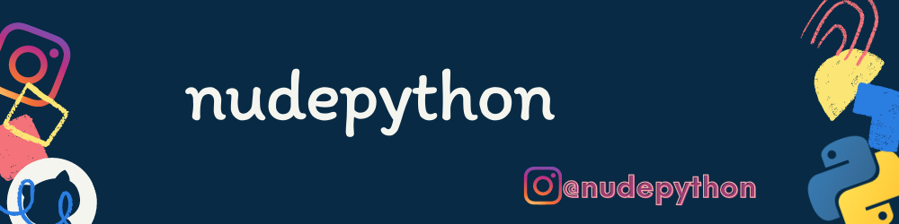

- 👋 Hi, I’m @nudepython
- 👀 I’m interested in PYTHON
- 📫 How to reach me [instagram](https://www.instagram.com/nudepython/)

<!---
nudepython/nudepython is a ✨ special ✨ repository because its `README.md` (this file) appears on your GitHub profile.
You can click the Preview link to take a look at your changes.
--->
